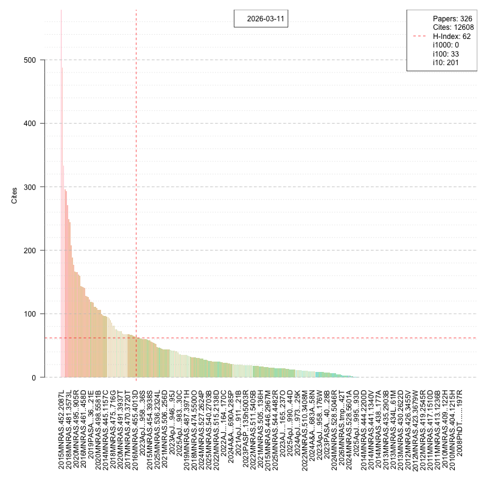

# ADS — NASA ADS API for R

[](https://github.com/asgr/ADS/actions/workflows/ads_metrics.yml)

`ADS` is a lightweight R package for interacting with the [NASA Astrophysics Data System (ADS)](https://ui.adsabs.harvard.edu/) API.  It lets you fetch citation metrics and formatted references for papers stored in your ADS libraries and produce publication-quality visualisations of your citation record.

---

## Installation

```r
# install.packages("remotes")
remotes::install_github("asgr/ADS")
```

### Dependencies

| Package | Role |
|---------|------|
| [httr](https://httr.r-lib.org/) | HTTP requests to the ADS API |
| [foreach](https://cran.r-project.org/package=foreach) | Iteration over paper lists |
| [magicaxis](https://github.com/asgr/magicaxis) | Enhanced plotting utilities |

---

## Setup — ADS API Token

All functions that talk to the ADS API require a personal API token.

1. Log in at <https://ui.adsabs.harvard.edu>.
2. Go to **Account → Settings → API Token**.
3. Copy the token and pass it as the `Authorisation` argument (or store it as an environment variable, e.g. `ADS_TOKEN`).

---

## Quick-start

```r
library(ADS)
library(httr)

token <- Sys.getenv("ADS_TOKEN")   # or paste your token directly

# ── 1. Fetch bibcodes from an ADS library ─────────────────────────────────────
resp   <- ADS_library(library = "-I4xxWbuR_-7f2b77Te36Q", Authorisation = token)
papers <- unlist(content(resp)$documents)

# ── 2. Retrieve citation metrics ──────────────────────────────────────────────
m <- ADS_metrics(papers = papers, Authorisation = token)

# ── 3. Print a summary (total cites, H-index, per-paper breakdown) ────────────
print(m)
# Total: 4321
# H-Index: 32
#
# 2015PASA...32...33R 512 2341
# ...

# ── 4. Plot a citation bar chart ──────────────────────────────────────────────
plot(m)

# ── 5. Export formatted references ────────────────────────────────────────────
ex <- ADS_export(papers = papers[1:3], Authorisation = token)
print(ex)

# ── 6. Open a paper in the browser ────────────────────────────────────────────
ADS_goto("2015PASA...32...33R")
```

---

## Function reference

| Function | Description |
|----------|-------------|
| `ADS_library()` | Fetch the list of bibcodes in an ADS library |
| `ADS_metrics()` | Retrieve citation/read metrics for a set of papers |
| `print.ADS_metrics()` | Print total cites, H-index, and per-paper summary |
| `plot.ADS_metrics()` | Bar chart of citations coloured by read count |
| `ADS_export()` | Export formatted citation strings for a set of papers |
| `print.ADS_export()` | Print the formatted citation strings |
| `get_ADS_info()` | Extract a specific metric from an `ADS_metrics` object |
| `ADS_goto()` | Open a paper's ADS abstract page in the default browser |

Full documentation is available via `?<function_name>` once the package is installed.

---

## Metric plot

The `plot.ADS_metrics` method draws a bar chart where:

* bars are sorted in **decreasing citation order**,
* bar **colour** encodes the total read count (blue = few reads → green → red = many reads),
* a **red dashed line** marks the H-index.

Example output (ASGR group library):



---

## Automated metrics workflow

The repository includes a GitHub Actions workflow (`.github/workflows/ads_metrics.yml`) that runs `exec/check_metrics.R` on a schedule.  It fetches the latest metrics for two ADS libraries and saves PNG plots to the `data/` folder.

To use this in your own fork:

1. Add your ADS API token as a repository secret named `ADS_TOKEN`.
2. Update the library IDs in `exec/check_metrics.R` to point to your own ADS libraries.

---

## License

LGPL-3 © Aaron Robotham
